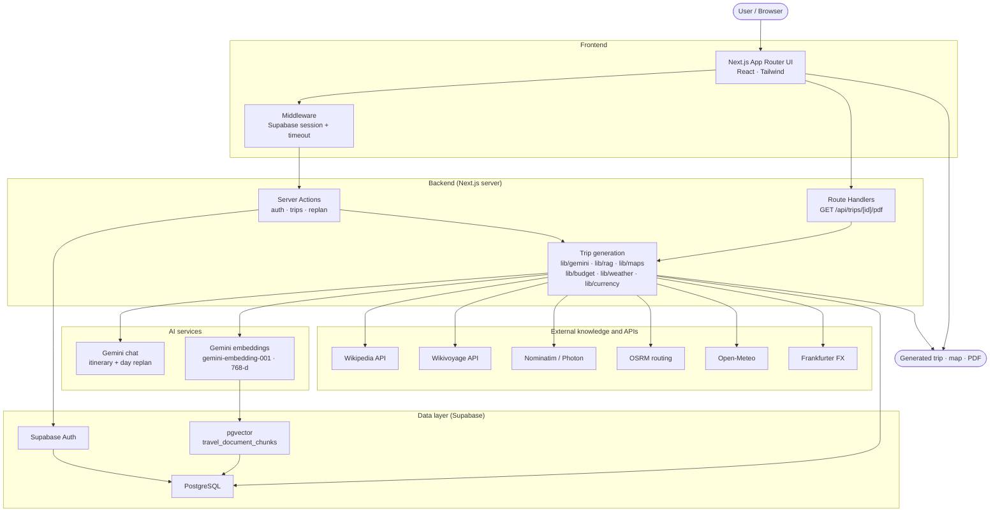
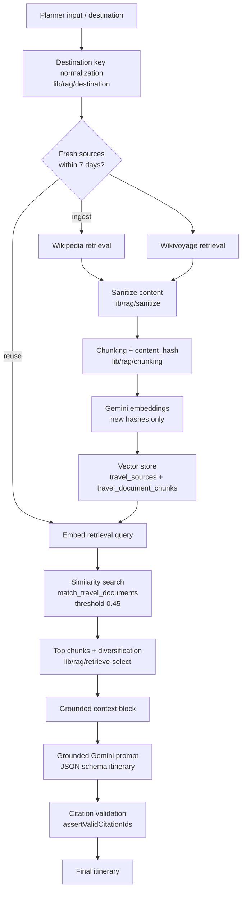
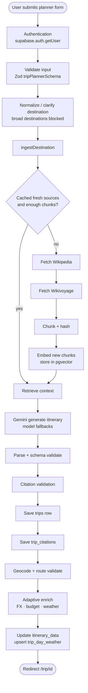
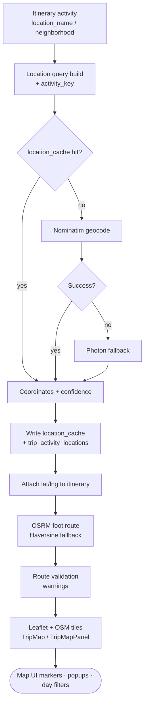
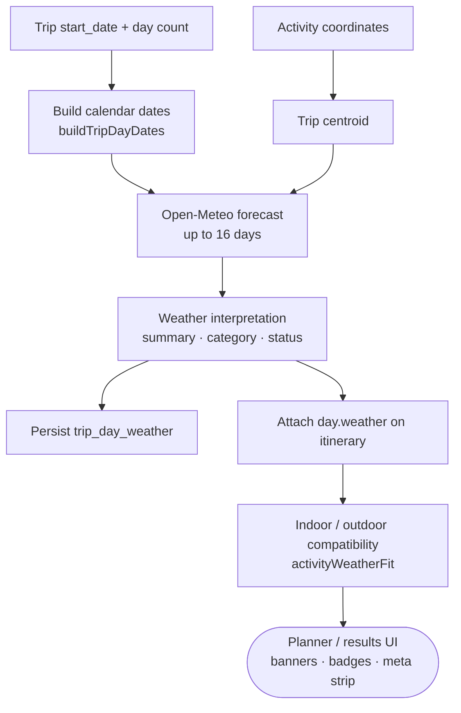
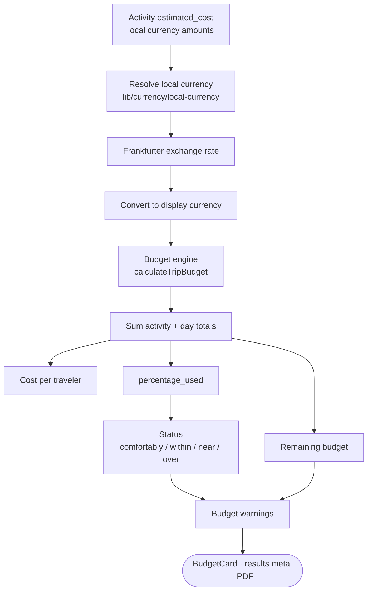
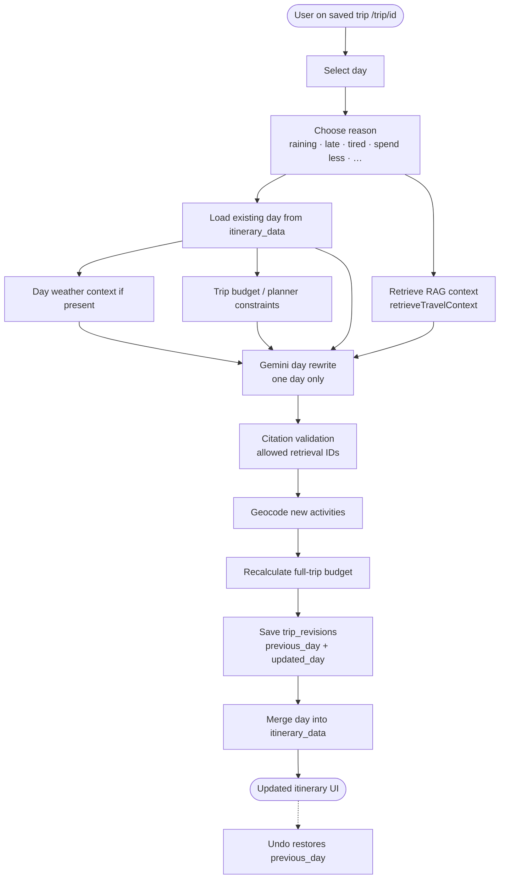
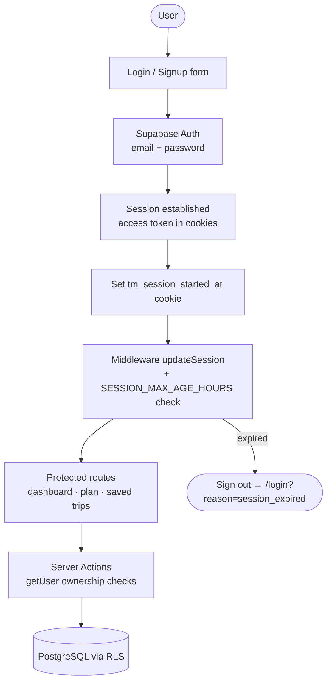
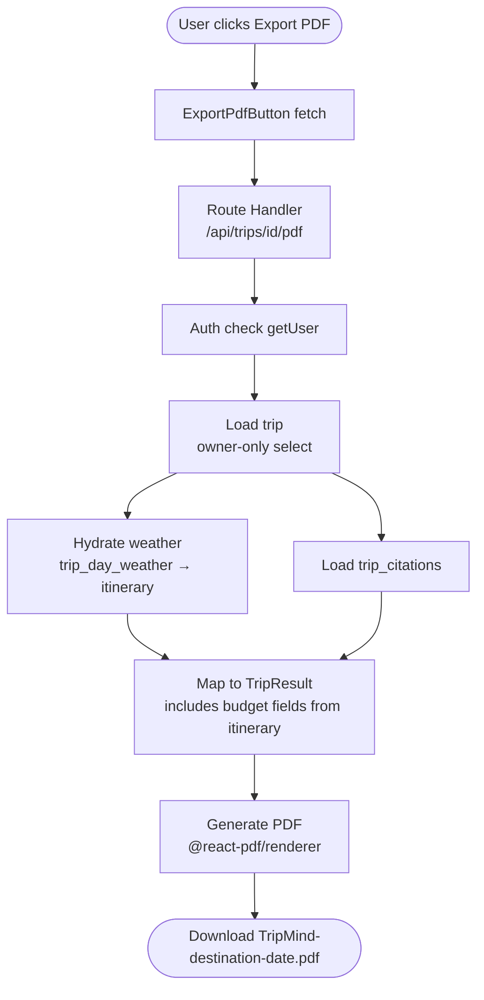

# TripMind

**AI-powered travel planning with retrieval-augmented generation, verified sources, maps, weather, and budget-aware itineraries.**

## 🚀 Live Demo

**Production:** https://tripmind-rag.vercel.app

TripMind helps travelers build personalized day-by-day trip plans grounded in Wikipedia and Wikivoyage—not unconstrained LLM guesses.

<p align="center">
  <a href="https://tripmind-rag.vercel.app"></a>
  <a href="https://github.com/singh-khushi30/tripmind-rag"></a>
  <a href="#license"></a>
</p>

<p align="center">
  
  
  
  
  
  
  
  
  
</p>

---

## Table of contents

- [Live Demo](#-live-demo)
- [Overview](#overview)
- [Demo](#demo)
- [Features](#features)
- [Architecture diagrams](#architecture-diagrams)
  - [1. System architecture](#1-system-architecture)
  - [2. RAG pipeline](#2-rag-pipeline)
  - [3. Database ER diagram](#3-database-er-diagram)
  - [4. Trip generation flow](#4-trip-generation-flow)
  - [5. Map and geocoding flow](#5-map-and-geocoding-flow)
  - [6. Weather flow](#6-weather-flow)
  - [7. Budget engine flow](#7-budget-engine-flow)
  - [8. Re-plan flow](#8-re-plan-flow)
  - [9. Auth flow](#9-auth-flow)
  - [10. PDF export flow](#10-pdf-export-flow)
- [Database](#database)
- [AI pipeline](#ai-pipeline)
- [RAG pipeline](#rag-pipeline)
- [Maps](#maps)
- [Weather](#weather)
- [Budget engine](#budget-engine)
- [Re-planning](#re-planning)
- [PDF export](#pdf-export)
- [Folder structure](#folder-structure)
- [Getting started](#getting-started)
- [Environment variables](#environment-variables)
- [Running locally](#running-locally)
- [Testing](#testing)
- [Security](#security)
- [Performance](#performance)
- [Future improvements](#future-improvements)
- [Lessons learned](#lessons-learned)
- [License](#license)
- [Author](#author)

---

## Overview

### What TripMind is

TripMind is a full-stack **AI travel planner**. Users sign in, describe destination preferences (dates, budget, travelers, style, pace, interests), and receive a structured multi-day itinerary with:

- activities and timing
- estimated costs
- Wikipedia / Wikivoyage citations
- interactive maps
- weather-aware notes
- budget utilization
- optional per-day re-planning
- PDF export for saved trips

The application code lives in [`Frontend/`](./Frontend). SQL migrations live in [`supabase/migrations/`](./supabase/migrations).

### Why it was built

Most “AI trip planners” ask a language model to invent an itinerary from parametric memory. That produces fluent plans that often include:

- closed or misplaced attractions
- invented opening hours and prices
- routes that are geographically absurd
- no audit trail for claims

TripMind treats itinerary generation as a **grounded systems problem**: retrieve travel evidence first, constrain generation second, validate citations and geometry third, then enrich with weather and budget math the model is not trusted to own.

### Problem it solves

Travelers need plans that are:

| Need | TripMind approach |
| --- | --- |
| Personalized | Planner form → Gemini with user constraints |
| Trustworthy | RAG over Wikipedia + Wikivoyage |
| Auditable | Per-activity citation IDs + `trip_citations` |
| Geographically sane | Nominatim/Photon geocoding + route validation |
| Budget-aware | App-side budget engine + Frankfurter FX |
| Adaptive | Open-Meteo weather + day re-plan / undo |

### Why unconstrained AI planners are unreliable

LLMs optimize for plausible language, not verified geography. Without retrieval and validation they:

1. Hallucinate venues and neighborhoods
2. Mix cities or seasons
3. Invent costs in the wrong currency
4. Ignore walking distance and transfer time
5. Provide no source trail when a claim looks wrong

### How RAG improves reliability

TripMind’s generation path:

1. Fetches Wikipedia and Wikivoyage pages for the destination
2. Chunks and embeds content with Gemini embeddings (`gemini-embedding-001`, **768** dimensions)
3. Stores vectors in Postgres via **pgvector** (HNSW, cosine distance)
4. Retrieves destination-scoped chunks above a similarity threshold
5. Injects a grounded context block into the Gemini prompt
6. **Rejects fabricated citation IDs** that were not returned by retrieval
7. Persists only citations that map to real chunk/source rows

The model still proposes structure and sequencing; factual place guidance is anchored to retrieved pages. Prices remain estimates and are labeled as such in the UI and PDF disclaimer.

---

## Demo

### Live demo

The application is live and can be accessed here:

https://tripmind-rag.vercel.app

You can create a free account using email authentication and generate personalized AI-powered travel itineraries.

### Local preview

```bash
cd Frontend
pnpm install
pnpm dev
```

Open [http://localhost:3000](http://localhost:3000). Demo itinerary UI is available at `/trip/results` (sample Kyoto preview; PDF export and day re-plan require a saved trip).

---

## Features

| Feature | Status | Implementation notes |
| --- | --- | --- |
| **Authentication** | Implemented | Supabase Auth (email/password); login, signup, logout; middleware session refresh |
| **Session timeout** | Implemented | App-enforced cookie `tm_session_started_at`; default **1 hour** (`SESSION_MAX_AGE_HOURS`) |
| **Trip generation** | Implemented | Server Action `createTripAction` → ingest → retrieve → Gemini → save |
| **Semantic search** | Implemented | Query embedding + `match_travel_documents` RPC (destination-scoped) |
| **RAG** | Implemented | Wikipedia + Wikivoyage ingest, chunk, embed, retrieve, ground, cite |
| **Wikipedia retrieval** | Implemented | MediaWiki API fetch in `lib/rag/sources/wikipedia` |
| **Wikivoyage retrieval** | Implemented | MediaWiki API fetch in `lib/rag/sources/wikivoyage` |
| **Embeddings** | Implemented | Gemini `gemini-embedding-001`, 768-d vectors |
| **Vector search** | Implemented | pgvector HNSW on `travel_document_chunks.embedding` |
| **Verified citations** | Implemented | Citation IDs must match retrieved chunk IDs; stored in `trip_citations` |
| **Interactive maps** | Implemented | Leaflet + OpenStreetMap tiles; day filters; numbered markers |
| **Geocoding** | Implemented | Nominatim primary, Photon fallback; `location_cache` |
| **Routing** | Implemented | OSRM foot routing with Haversine fallback |
| **Route validation** | Implemented | Segment distance/time checks, backtracking, missing coords warnings |
| **Weather-aware planning** | Implemented | Open-Meteo forecasts; indoor/outdoor `weather_fit` |
| **Budget engine** | Implemented | Deterministic totals in `lib/budget/calculate-trip-budget` |
| **Currency conversion** | Implemented | Frankfurter FX; local currency resolution map |
| **Re-plan my day** | Implemented | Saved trips only; reason codes; Gemini day rewrite |
| **Undo changes** | Implemented | `trip_revisions` stores previous/updated day JSON |
| **Saved trips** | Implemented | Dashboard / saved-trips grid; delete; open `/trip/[id]` |
| **PDF export** | Implemented | `@react-pdf/renderer` via `GET /api/trips/[id]/pdf` |
| **Password visibility** | Implemented | Shared `PasswordInput` on login/signup |
| **Responsive UI** | Implemented | Mobile nav, stacked results layout, touch-friendly controls |
| **Hotel booking** | Not implemented | See [Future improvements](#future-improvements) |
| **Flight booking** | Not implemented | See [Future improvements](#future-improvements) |

---

## Architecture diagrams

All diagrams below use Mermaid and render on GitHub. They reflect the current `Frontend/` + `supabase/migrations/` implementation—not a separate microservice fleet. “Trip generation” means Next.js Server Actions and `lib/*` modules running in the Next.js server runtime.

---

### 1. System architecture

**Title:** TripMind high-level system architecture



---

### 2. RAG pipeline

**Title:** Retrieval-Augmented Generation pipeline



---

### 3. Database ER diagram

**Title:** TripMind PostgreSQL entity relationships

```mermaid
erDiagram
  AUTH_USERS ||--o{ TRIPS : owns
  AUTH_USERS ||--o{ TRIP_REVISIONS : owns
  TRIPS ||--o{ TRIP_CITATIONS : has
  TRIPS ||--o{ TRIP_ACTIVITY_LOCATIONS : has
  TRIPS ||--o{ TRIP_DAY_WEATHER : has
  TRIPS ||--o{ TRIP_REVISIONS : has
  TRAVEL_SOURCES ||--o{ TRAVEL_DOCUMENT_CHUNKS : contains
  TRAVEL_DOCUMENT_CHUNKS ||--o{ TRIP_CITATIONS : cited_as
  TRAVEL_SOURCES ||--o{ TRIP_CITATIONS : cited_from

  AUTH_USERS {
    uuid id PK
  }

  TRIPS {
    uuid id PK
    uuid user_id FK
    text destination
    date start_date
    int number_of_days
    numeric budget
    text currency
    int travelers
    text travel_style
    text travel_pace
    text_array interests
    text status
    jsonb itinerary_data
    timestamptz created_at
    timestamptz updated_at
  }

  TRAVEL_SOURCES {
    uuid id PK
    text destination_key
    text destination_name
    text source_type
    text source_title
    text source_url UK
    text content_hash
    timestamptz fetched_at
  }

  TRAVEL_DOCUMENT_CHUNKS {
    uuid id PK
    uuid source_id FK
    int chunk_index
    text content
    text content_hash
    vector_768 embedding
  }

  TRIP_CITATIONS {
    uuid id PK
    uuid trip_id FK
    uuid travel_chunk_id FK
    uuid travel_source_id FK
    text citation_key
    text source_type
    text source_title
    text source_url
  }

  TRIP_ACTIVITY_LOCATIONS {
    uuid id PK
    uuid trip_id FK
    text activity_key
    text location_name
    float latitude
    float longitude
    text confidence
  }

  TRIP_DAY_WEATHER {
    uuid id PK
    uuid trip_id FK
    int day_number
    date forecast_date
    text weather_status
    numeric temp_min
    numeric temp_max
    text summary
  }

  TRIP_REVISIONS {
    uuid id PK
    uuid trip_id FK
    uuid user_id FK
    int day_number
    text reason
    jsonb previous_day
    jsonb updated_day
    timestamptz created_at
  }

  LOCATION_CACHE {
    text normalized_query PK
    float latitude
    float longitude
    text provider
    text confidence
  }
```



`location_cache` is a shared geocode cache (no FK to `trips`). Writes use the service-role client.

---

### 4. Trip generation flow

**Title:** End-to-end trip generation (`createTripAction`)



---

### 5. Map and geocoding flow

**Title:** Activity geocoding, routing, and map UI



---

### 6. Weather flow

**Title:** Weather enrichment and activity fit



If `start_date` or coordinates are missing, status becomes `no_start_date` / `no_coordinates` and the UI shows an unavailable state instead of inventing forecasts.

---

### 7. Budget engine flow

**Title:** Deterministic budget calculation (app-owned, not Gemini totals)



---

### 8. Re-plan flow

**Title:** Day-scoped re-plan + undo (`replanTripDayAction`)



Demo route `/trip/results` does **not** expose re-plan (no durable trip id).

---

### 9. Auth flow

**Title:** Authentication and protected server access



---

### 10. PDF export flow

**Title:** Server-side PDF export (`GET /api/trips/[id]/pdf`)



Budget is not loaded from a separate table—it is derived from saved `itinerary_data` / mapper fields when building `TripResult`.

---

## Database

Migrations are numbered SQL files under `supabase/migrations/`. **They are not auto-applied by the app**—run them manually in the Supabase SQL Editor in order (`001` → `005`).

### Entity overview

See the Mermaid [Database ER diagram](#3-database-er-diagram) above for PK/FK relationships.

```text
auth.users
    │
    ├── trips
    │     ├── trip_citations ──► travel_document_chunks ──► travel_sources
    │     ├── trip_activity_locations
    │     ├── trip_day_weather
    │     └── trip_revisions
    │
location_cache   (shared geocode cache; service-role writes)
```

### `trips`

| | |
| --- | --- |
| **Purpose** | Primary user itinerary record |
| **Key fields** | `destination`, `start_date`, `number_of_days`, `budget`, `currency`, `travelers`, `travel_style`, `travel_pace`, `interests[]`, `food_preference`, `special_notes`, `status`, `itinerary_data` (JSONB) |
| **Relationships** | `user_id` → `auth.users`; parent of citations, locations, weather, revisions |
| **RLS** | Owner-only select/insert/update/delete |
| **Constraints** | Days 1–30; travelers 1–20; budget > 0; status ∈ `draft` \| `generated` \| `updated` \| `completed` |

### `travel_sources`

| | |
| --- | --- |
| **Purpose** | Normalized Wikipedia / Wikivoyage page metadata |
| **Key fields** | `destination_key`, `destination_name`, `country`, `source_type`, `source_title`, `source_url` (unique), `content_hash`, `full_content`, `fetched_at` |
| **Relationships** | 1 → N `travel_document_chunks` |
| **RLS** | Authenticated read; writes via **service role** only |

### `travel_document_chunks`

| | |
| --- | --- |
| **Purpose** | Embedded text chunks for vector search |
| **Key fields** | `source_id`, `section_title`, `chunk_index`, `content`, `content_hash`, `embedding vector(768)` |
| **Indexes** | HNSW (`vector_cosine_ops`) |
| **RLS** | Authenticated read; writes via service role |

Legacy note: migration `002` created `travel_documents`; migration `003` normalizes into sources + chunks and renames the old table to `travel_documents_legacy`.

### `trip_citations`

| | |
| --- | --- |
| **Purpose** | Trip-level provenance for UI “Sources used” and PDF |
| **Key fields** | `trip_id`, `travel_chunk_id`, `travel_source_id`, `citation_key`, `source_type`, `source_title`, `source_url`, `section_title` |
| **Relationships** | Belongs to trip; FKs to chunk + source |
| **RLS** | Users may select/insert citations for their own trips |

### `location_cache`

| | |
| --- | --- |
| **Purpose** | Shared geocode cache keyed by `normalized_query` |
| **Key fields** | `latitude`, `longitude`, `display_name`, `provider`, `confidence`, `fetched_at` |
| **RLS** | Authenticated read; service-role writes |

### `trip_activity_locations`

| | |
| --- | --- |
| **Purpose** | Per-trip activity coordinates |
| **Key fields** | `trip_id`, `activity_key`, `activity_title`, `location_name`, lat/lng, `confidence` (`exact` \| `approximate` \| `unavailable`) |
| **RLS** | Owner select/insert |

### `trip_day_weather`

| | |
| --- | --- |
| **Purpose** | Persisted daily forecasts for a trip |
| **Key fields** | `day_number`, `forecast_date`, `weather_status`, temps, precip, `summary`, `category` |
| **Statuses** | `available`, `forecast_unavailable`, `service_unavailable`, `no_coordinates`, `no_start_date` |
| **RLS** | Owner select/insert/update |

### `trip_revisions`

| | |
| --- | --- |
| **Purpose** | Undo stack for day re-plans |
| **Key fields** | `trip_id`, `user_id`, `day_number`, `reason`, `previous_day` (JSONB), `updated_day` (JSONB) |
| **RLS** | Owner select/insert/delete |

### RPC: `match_travel_documents`

Destination-scoped similarity search:

- Input: `query_embedding vector(768)`, `match_destination`, `match_count` (default 12), `similarity_threshold` (default **0.45**)
- Returns chunk + source metadata ordered by cosine distance
- Similarity = `1 - (embedding <=> query_embedding)`

---

## AI pipeline

End-to-end generation (excluding mock mode):

```text
User submits trip
        ↓
Destination validation / clarification (broad destinations blocked)
        ↓
Destination key normalization
        ↓
Wikipedia retrieval
        ↓
Wikivoyage retrieval
        ↓
Chunking (+ content hashing)
        ↓
Embedding generation (new hashes only)
        ↓
Vector storage (sources + chunks)
        ↓
Semantic retrieval (planner-aware query)
        ↓
Grounded Gemini prompt (system + user + JSON schema)
        ↓
Structured itinerary parse / Zod validate
        ↓
Citation validation (no fabricated IDs)
        ↓
Database save (trip + citations)
        ↓
Geocode + route validate
        ↓
Adaptive enrich (currency, budget, weather)
        ↓
Redirect to trip page
```

### Models and resilience

| Concern | Behavior |
| --- | --- |
| Chat model | Default `gemini-3.6-flash` (override with `GEMINI_MODEL`) |
| Fallbacks | `GEMINI_MODEL_FALLBACKS` comma list; retries per model then next candidate |
| Embeddings | `GEMINI_EMBEDDING_MODEL` or default `gemini-embedding-001` |
| Dev mock | `USE_MOCK_ITINERARY=true` skips Gemini/RAG (explicit only) |

### What Gemini is trusted for

- Day structure, activity titles/descriptions, sequencing
- Choosing which retrieved citation IDs to attach
- Preference alignment (pace, style, interests)

### What Gemini is **not** trusted for

- Final budget arithmetic (recalculated in app code)
- Exchange rates (Frankfurter)
- Weather numbers (Open-Meteo)
- Citation inventiveness (validated against retrieval set)

---

## RAG pipeline

### Chunking

MediaWiki pages are parsed into section-aware chunks (`lib/rag/chunking.ts`). Each chunk gets a `content_hash` so re-ingestion can skip unchanged text.

### Embeddings

- Model: Gemini embedding API
- Dimensionality: **768** (`outputDimensionality`)
- Batched with small delays to respect rate limits
- Dimension asserted before upsert

### Similarity search

1. Build a retrieval query from destination + interests + style + pace + notes
2. Embed the query
3. Call `match_travel_documents` filtered by `destination_key`
4. Keep results ≥ similarity threshold **0.45**
5. Diversify across sources / sections (`retrieve-select`)
6. Cap context size (~**12,000** characters)

Freshness: sources fetched within **`RAG_FRESHNESS_DAYS` (7)** can be reused without full re-fetch when enough chunks exist (`RAG_MIN_CHUNKS` = 4). Cap per destination ingest: **`RAG_MAX_CHUNKS_PER_DESTINATION` (36)**.

### Grounding

Retrieved chunks are formatted into a context block passed to the itinerary prompt. The model is instructed to use provided sources and cite chunk IDs.

### Citation validation

`assertValidCitationIds`:

- Allows only chunk IDs present in the retrieval set
- Throws on fabricated IDs
- Backfills a valid ID if an activity omitted citations

This is the primary hallucination brake for **source attribution**. It does not magically make every sentence true; it ensures cited IDs are real retrieved documents.

### Why hallucinations are reduced

| Failure mode | Mitigation |
| --- | --- |
| Invented attractions with no source | Grounding context + citation requirement |
| Fake citation UUIDs | Hard validation against retrieval |
| Stale generic world knowledge | Destination-scoped retrieval + freshness window |
| Duplicate noisy chunks | Hash dedupe + diversification |
| Unrelated destinations leaking in | `destination_key` filter on match RPC |

---

## Maps

### Geocoding

Server-side only (`lib/maps/geocode.ts`):

1. Normalize query
2. Check `location_cache`
3. Query **Nominatim** (rate-limited ~1 req/s)
4. Fall back to **Photon** (Komoot)
5. Cache successful results
6. Confidence: `exact` / `approximate` / `unavailable`

Null Island `(0,0)` is rejected by DB constraints and geocode validation.

### Route validation

After geocoding, TripMind checks day geometry (`lib/maps/validate-route.ts`):

- long transfers
- long travel time
- excessive backtracking
- impossible same-day spans
- cross-city spread
- missing coordinates

Warnings surface on the map panel; generation can attempt light repair flows when configured in the maps pipeline.

### Markers and daily routes

- Leaflet map with OSM tiles
- Numbered markers per activity order
- Approximate stops use distinct styling + radius hint
- Day filter tabs (`Day N` / `All days`)
- Polyline from **OSRM** foot routing when available, else Haversine estimate
- OpenStreetMap deep link for the current view

### Empty / error states

If coordinates are missing or the map client fails, the UI shows a calm empty/error panel; the itinerary remains usable without the map.

---

## Weather

### Forecast retrieval

- Provider: **Open-Meteo** (`api.open-meteo.com`) — no API key
- Horizon: **16** forecast days
- Requires trip start date + usable coordinates (centroid from activity lat/lng)
- Persisted to `trip_day_weather`

### Interpretation

Forecasts are summarized into human-readable `summary` / `category` fields for the UI and day banners.

### Indoor / outdoor compatibility

`activityWeatherFit` scores each activity (`good` / `caution` / `poor` / `unavailable`) from:

- activity `indoor_outdoor`
- day weather category
- start time

Re-plan reasons include weather-aware options (for example “It's raining”, “More indoor activities”).

---

## Budget engine

Implemented in `lib/budget/calculate-trip-budget.ts`. The UI does **not** trust Gemini’s `estimated_total_cost` as the source of truth after enrichment.

### Currency conversion

1. Resolve destination **local currency** (`lib/currency/local-currency`)
2. Fetch FX via **Frankfurter** (`api.frankfurter.app`)
3. Convert activity costs to the user’s **display currency**
4. Record `exchange_rate` + `exchange_status` (`live_or_latest` / estimated / unavailable)

### Calculations

| Metric | Definition |
| --- | --- |
| Activity totals | Sum of activity costs (local + display) |
| Calculated trip total | App-side sum in display currency |
| Per-traveler cost | Total ÷ travelers |
| Remaining budget | User budget − calculated total |
| Utilization | `percentage_used` |
| Status | `comfortably_within_budget` (≤70%), `within_budget`, `near_budget` (≥90%), `over_budget` (>100%) |

Warnings are generated from utilization (over / near / remaining). Planner checkboxes control whether accommodation and long-distance transport-to-destination are expected in the budget framing.

---

## Re-planning

### How one day is modified

On a **saved** trip (`/trip/[id]`), each day exposes re-plan controls:

1. User picks a reason code (raining, running late, tired, spend less, less busy, more food/culture/indoor, or custom)
2. Server re-retrieves grounding context
3. Gemini regenerates **only that day’s** activities
4. Citations must still be valid IDs from retrieval
5. New stops are geocoded; full-trip budget is recalculated
6. A `trip_revisions` row stores before/after day JSON

### Why the entire trip is not regenerated

Full regeneration is expensive, slow, and destructive to days the traveler already liked. Day-scoped edits preserve:

- other days’ plans
- overall trip metadata
- existing citations where still used
- revision history for undo

Demo page `/trip/results` does **not** expose re-plan (no durable trip id).

### How citations are preserved

Re-plan passes `allowedCitationKeys` / retrieved chunk IDs into validation. Fabricated citations fail the same way as initial generation. Sources panel continues to list Wikipedia / Wikivoyage pages linked from `trip_citations`.

### Undo

`undoTripDayReplanAction` restores the latest stored `previous_day` for that day number and updates `itinerary_data`.

---

## PDF export

### Endpoint

```http
GET /api/trips/[id]/pdf
```

Implemented with **`@react-pdf/renderer`** (`lib/pdf/*`).

### What is exported

- TripMind-branded header
- Destination summary, dates, travelers, style/pace
- Budget snapshot
- Day-by-day activities (times, locations, estimates, durations)
- Weather notes when present
- Citation list with URLs
- Disclaimer that prices/weather/availability should be verified

Filename pattern: `TripMind-<destination>-<date>.pdf` (see `lib/pdf/filename.ts`).

### Why server-side generation

| Reason | Detail |
| --- | --- |
| Auth | Owner check runs with server Supabase session |
| Secrets | No client PDF pipeline needing privileged data access |
| Consistency | Same document for every browser |
| Security | Service stays behind Route Handler; `Cache-Control: no-store` |

UI: `ExportPdfButton` shows loading, success, and retry states.

---

## Folder structure

Repository layout (application code under `Frontend/`):

```text
TripMind/
├── README.md
├── supabase/
│   └── migrations/
│       ├── 001_create_trips.sql
│       ├── 002_create_travel_rag.sql
│       ├── 003_normalize_travel_sources.sql
│       ├── 004_create_trip_locations.sql
│       └── 005_create_weather_and_revisions.sql
└── Frontend/
    ├── app/
    │   ├── api/trips/[id]/pdf/     # PDF Route Handler
    │   ├── auth/                   # Auth server actions
    │   ├── dashboard/
    │   ├── login/
    │   ├── signup/
    │   ├── saved-trips/
    │   ├── trip/
    │   │   ├── [id]/              # Saved trip results
    │   │   ├── plan/               # Planner
    │   │   └── results/            # Demo preview
    │   ├── trips/                  # Trip server actions
    │   ├── layout.tsx
    │   └── page.tsx                # Landing
    ├── components/
    │   ├── auth/
    │   ├── cards/
    │   ├── dashboard/
    │   ├── forms/
    │   ├── layout/
    │   ├── loading/
    │   ├── map/
    │   ├── states/
    │   ├── trip/
    │   └── ui/
    ├── lib/
    │   ├── auth/
    │   ├── budget/
    │   ├── currency/
    │   ├── destinations/
    │   ├── gemini/
    │   ├── maps/
    │   ├── pdf/
    │   ├── rag/
    │   │   └── sources/            # Wikipedia + Wikivoyage
    │   ├── replanning/
    │   ├── supabase/
    │   ├── trip/
    │   ├── trips/
    │   ├── validation/
    │   └── weather/
    ├── scripts/                    # rag:test helpers
    ├── styles/
    ├── types/
    ├── utils/
    ├── hooks/                      # reserved (currently empty)
    ├── public/
    ├── middleware.ts
    ├── package.json
    └── vitest.config.mts
```

---

## Getting started

### Prerequisites

- **Node.js** 20+ (Node 22+ recommended for current Supabase JS guidance)
- **pnpm** `10.19.0` (see `packageManager` in `Frontend/package.json`)
- A **Supabase** project (Auth + Postgres)
- A **Gemini API key** from [Google AI Studio](https://aistudio.google.com/apikey)
- Ability to run SQL migrations in the Supabase SQL Editor

### Installation

```bash
git clone https://github.com/singh-khushi30/tripmind-rag.git
cd tripmind-rag/Frontend
pnpm install
cp .env.example .env.local
```

Fill `.env.local` (see [Environment variables](#environment-variables)).

### Database setup

In the Supabase SQL Editor, run in order:

1. `supabase/migrations/001_create_trips.sql`
2. `supabase/migrations/002_create_travel_rag.sql`
3. `supabase/migrations/003_normalize_travel_sources.sql`
4. `supabase/migrations/004_create_trip_locations.sql`
5. `supabase/migrations/005_create_weather_and_revisions.sql`

Enable the `vector` extension if your project does not already (migration `002` creates it under schema `extensions`).

### Run locally

```bash
pnpm dev
```

App: [http://localhost:3000](http://localhost:3000)

---

## Environment variables

Defined in `Frontend/.env.example` and consumed by server/client modules as noted.

| Variable | Required | Client-visible | Description |
| --- | --- | --- | --- |
| `NEXT_PUBLIC_SUPABASE_URL` | Yes | Yes | Supabase project URL |
| `NEXT_PUBLIC_SUPABASE_PUBLISHABLE_KEY` | Yes | Yes | Supabase publishable (anon) key for browser + SSR clients |
| `SUPABASE_SERVICE_ROLE_KEY` | Yes (for RAG ingest) | **No** | Service role for source/chunk upserts; never `NEXT_PUBLIC_` |
| `GEMINI_API_KEY` | Yes (unless mock) | **No** | Google AI Studio Gemini API key |
| `GEMINI_EMBEDDING_MODEL` | No | **No** | Embedding model; default `gemini-embedding-001` |
| `GEMINI_MODEL` | No | **No** | Chat model; default `gemini-3.6-flash` |
| `GEMINI_MODEL_FALLBACKS` | No | **No** | Comma-separated fallback chat models |
| `USE_MOCK_ITINERARY` | No | **No** | `true` forces mock itinerary (explicit; not silent fallback) |
| `SESSION_MAX_AGE_HOURS` | No | **No** | App session lifetime hours; default `1` |
| `MAPS_DEBUG` | No | **No** | Optional geocode debug logging |

Maps (Nominatim, Photon, OSRM), weather (Open-Meteo), and FX (Frankfurter) require **no keys**.

```bash
# Frontend/.env.local (example shape — do not commit secrets)
NEXT_PUBLIC_SUPABASE_URL=https://YOUR_PROJECT.supabase.co
NEXT_PUBLIC_SUPABASE_PUBLISHABLE_KEY=YOUR_PUBLISHABLE_KEY
SUPABASE_SERVICE_ROLE_KEY=YOUR_SERVICE_ROLE_KEY
GEMINI_API_KEY=YOUR_GEMINI_KEY
GEMINI_EMBEDDING_MODEL=gemini-embedding-001
USE_MOCK_ITINERARY=false
# SESSION_MAX_AGE_HOURS=1
```

---

## Running locally

From `Frontend/`:

| Command | Purpose |
| --- | --- |
| `pnpm install` | Install dependencies |
| `pnpm dev` | Dev server with Turbopack |
| `pnpm build` | Production build |
| `pnpm start` | Serve production build |
| `pnpm lint` | ESLint |
| `pnpm typecheck` | `tsc --noEmit` |
| `pnpm test` | Vitest unit tests |
| `pnpm test:watch` | Vitest watch mode |
| `pnpm rag:test` | Scripted RAG smoke test (`scripts/test-rag.ts`) |
| `pnpm format` | Prettier write |
| `pnpm format:check` | Prettier check |

`npm install` works if you prefer npm, but the repo is standardized on **pnpm**.

### Deploy (Vercel)

**Production:** https://tripmind-rag.vercel.app

Typical setup:

1. Set Root Directory to `Frontend` (or deploy from that folder)
2. Configure the env vars above in the Vercel project
3. Ensure Supabase Auth redirect URLs include the production origin (`https://tripmind-rag.vercel.app`)
4. Run SQL migrations before generating trips in production

---

## Testing

### Automated tests

```bash
cd Frontend
pnpm test
```

Coverage includes (non-exhaustive):

| Area | Example files |
| --- | --- |
| Auth session timeout | `lib/auth/session-timeout.test.ts` |
| Gemini env / fallbacks | `lib/gemini/env.test.ts`, `model-fallback.test.ts` |
| Itinerary validation | `lib/gemini/validate-itinerary.test.ts` |
| RAG chunking / citations / retrieve-select | `lib/rag/*.test.ts` |
| Maps geocode / markers / routes | `lib/maps/*.test.ts` |
| Weather | `lib/weather/weather.test.ts` |
| Currency | `lib/currency/currency.test.ts` |
| Budget | `lib/budget/calculate-trip-budget.test.ts` |
| Re-plan merge | `lib/replanning/replan-day.test.ts` |
| PDF | `lib/pdf/pdf.test.tsx` |

### Manual checklist

<details>
<summary>Authentication</summary>

- Sign up → confirm email flow per your Supabase Auth settings
- Sign in / sign out
- Wait past `SESSION_MAX_AGE_HOURS` (or temporarily set a short value) → redirected to login with session expired messaging
- Protected routes (`/dashboard`, `/trip/plan`, saved trips) require auth

</details>

<details>
<summary>Trip generation</summary>

- Submit planner with a specific city (broad country-only destinations should prompt clarification)
- Confirm redirect to `/trip/[id]`
- Confirm itinerary JSON rendered in day timeline

</details>

<details>
<summary>RAG</summary>

- First generation for a destination should ingest Wikipedia/Wikivoyage (service role required)
- Sources panel lists real URLs
- `pnpm rag:test` for scripted ingest/retrieve checks

</details>

<details>
<summary>Maps</summary>

- Markers appear when geocoding succeeds
- Day tabs filter markers
- Empty state when coordinates unavailable
- Route warnings appear for extreme day geometry when applicable

</details>

<details>
<summary>Weather</summary>

- With start date + coordinates: day weather banners and meta strip
- Without start date: explicit unavailable messaging (`no_start_date`)

</details>

<details>
<summary>Budget</summary>

- Display currency totals update after generation
- Utilization % and remaining/over warnings match activity sums
- Local vs display currency notes when FX is available

</details>

<details>
<summary>Re-plan</summary>

- On saved trip only: re-plan a day → activities change → undo restores prior day
- Demo `/trip/results` does not offer re-plan

</details>

<details>
<summary>PDF</summary>

- Export on saved trip downloads a PDF
- Unauthenticated / non-owner requests fail via API auth errors
- Demo trips cannot export

</details>

---

## Security

| Control | Detail |
| --- | --- |
| Server-side API keys | `GEMINI_API_KEY`, `SUPABASE_SERVICE_ROLE_KEY` never prefixed with `NEXT_PUBLIC_` |
| Service role isolation | Used for RAG ingestion writes via `lib/supabase/admin.ts` only |
| RLS | Trips, citations, locations, weather, revisions scoped to owning user |
| Travel corpus reads | Authenticated select on sources/chunks; no anon write policies |
| Citation validation | Fabricated citation IDs rejected before trust |
| PDF auth | Owner-only load inside Route Handler |
| Session timeout | Middleware signs out after max age even if refresh tokens remain |
| No client map secrets | OSM stack uses public endpoints; geocoding runs server-side |
| Mock itinerary | Explicit env flag only—never silent fallback after Gemini errors |

Do not commit `.env.local`. Rotate any key that appears in logs or shared docs.

---

## Performance

| Technique | Where |
| --- | --- |
| Destination source reuse | Skip re-fetch when fresh sources/chunks exist (7-day window) |
| Chunk hash dedupe | Only embed new `content_hash` values |
| Embedding batching | Batch size 8 + delay between batches |
| Vector index | HNSW on chunk embeddings |
| Destination-scoped search | Match RPC filters `destination_key` before ranking |
| Geocode cache | `location_cache` avoids repeat Nominatim/Photon calls |
| FX / weather caching | In-memory caches with timeouts in currency/weather modules |
| Model fallbacks | Avoid hard fail on single busy/retired model |
| Client map code-splitting | `TripMap` loaded with `dynamic(..., { ssr: false })` |
| Light geocode path | Trip page backfill can skip heavy OSRM/repair to avoid timeouts |

---

## Future improvements

Realistic next steps (not currently implemented):

| Idea | Why it fits |
| --- | --- |
| Hotel / lodging suggestions with affiliate or API partners | Budget already tracks accommodation inclusion flags |
| Flight / rail search integration | Complements “transport to destination” budget toggle |
| Collaborative trip editing | Requires multi-user ACL beyond current owner RLS |
| Multi-language itineraries + non-English Wikimedia | Corpus and prompts are English-first today |
| Offline PDF / PWA cache of saved trips | Export exists; offline sync does not |
| Stronger evaluation harness | Golden destinations, citation precision/recall dashboards |
| Booking deep links | Keep RAG grounding while adding actionable CTAs |

---

## Lessons learned

### Building scalable RAG systems

Retrieval quality depends more on **destination scoping, freshness, and citation discipline** than on prompt poetry. Separating `travel_sources` from `travel_document_chunks` made dedupe, provenance, and UI source lists clearer than a single denormalized documents table.

### Vector search

pgvector HNSW with cosine distance is enough for destination-local travel corpora. Filtering by `destination_key` before similarity ranking prevents cross-city contamination that pure global ANN search would introduce.

### AI grounding

Grounding fails closed: insufficient context or fabricated citations abort generation rather than shipping an untraceable plan. That is stricter UX, but it matches the product thesis—**trust over fluency**.

### Database design

JSONB `itinerary_data` keeps generation flexible, while normalized side tables (citations, locations, weather, revisions) support RLS, undo, and enrichment without rewriting the entire document model for every feature.

### Production architecture

Keeping Gemini, geocoding, FX, and weather on the server simplifies secret handling and lets Route Handlers / Server Actions own failure modes. Free geospatial and weather APIs are viable when rate limits, caching, and timeouts are treated as first-class engineering—not afterthoughts.

---

## License

MIT License

Copyright (c) 2026 Khushi Singh

Permission is hereby granted, free of charge, to any person obtaining a copy
of this software and associated documentation files (the "Software"), to deal
in the Software without restriction, including without limitation the rights
to use, copy, modify, merge, publish, distribute, sublicense, and/or sell
copies of the Software, and to permit persons to whom the Software is
furnished to do so, subject to the following conditions:

The above copyright notice and this permission notice shall be included in all
copies or substantial portions of the Software.

THE SOFTWARE IS PROVIDED "AS IS", WITHOUT WARRANTY OF ANY KIND, EXPRESS OR
IMPLIED, INCLUDING BUT NOT LIMITED TO THE WARRANTIES OF MERCHANTABILITY,
FITNESS FOR A PARTICULAR PURPOSE AND NONINFRINGEMENT. IN NO EVENT SHALL THE
AUTHORS OR COPYRIGHT HOLDERS BE LIABLE FOR ANY CLAIM, DAMAGES OR OTHER
LIABILITY, WHETHER IN AN ACTION OF CONTRACT, TORT OR OTHERWISE, ARISING FROM,
OUT OF OR IN CONNECTION WITH THE SOFTWARE OR THE USE OR OTHER DEALINGS IN THE
SOFTWARE.

> **TODO:** Add a root `LICENSE` file duplicating this text if you want GitHub’s license detection to pick it up automatically.

---

## Author

**Khushi Singh**

| | |
| --- | --- |
| GitHub | [singh-khushi30](https://github.com/singh-khushi30) |
| Repository | [singh-khushi30/tripmind-rag](https://github.com/singh-khushi30/tripmind-rag) |

---

<p align="center">
  <sub>Built with Next.js, Supabase, Gemini, and open travel knowledge.</sub>
</p>
